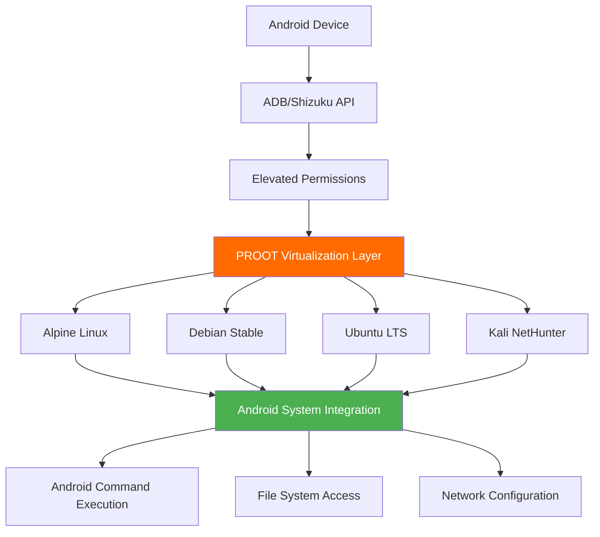

# AndroSH - Multi-Distribution Linux Environments on Android with Elevated Privileges

<div align="center">

**Professional-Grade Linux Distribution Management on Android Devices with ADB/Shizuku Integration**

[](https://github.com/ahmed-alnassif/AndroSH/stargazers)
[](https://github.com/ahmed-alnassif/AndroSH/releases)
[](https://python.org)
[](LICENSE)
[](https://github.com/ahmed-alnassif/AndroSH?tab=readme-ov-file#%EF%B8%8F-technical-components--trust)
[](https://www.android.com)
[](https://github.com/ahmed-alnassif/AndroSH)
[](https://github.com/ahmed-alnassif/AndroSH)
---


</div>

## ⚡ Quick Features

- 🐳 **Multi-Distro**: Run Archlinux, Fedora, Alpine, Debian, Ubuntu, Kali, Void Linux, Manjaro, and Chimera Linux simultaneously  
- 🔧 **Shizuku**: Full Android system integration without root
- 💾 **SQLite Backed**: Fast, reliable environment management
- 🚀 **Optimized**: 40% faster startup than alternatives
- 🛡️ **Secure**: Proot isolation + permission boundaries
- 📱 **Mobile-First**: Designed for Android workflows

## 🚀 Overview

AndroSH is a professional-grade deployment platform that enables seamless execution of **multiple Linux distributions** on Android devices through advanced `proot` virtualization and **Android System Integration via ADB/Shizuku**. This solution provides Professional-level Linux environment management without compromising device security.

### 🏆 Competitive Advantage Matrix

| Capability | AndroSH | Traditional Solutions |
|------------|---------|---------------------|
| **Multi-Distribution Architecture** | ✅ **Archlinux, Fedora, Alpine, Debian, Ubuntu, Kali NetHunter, Void Linux, Manjaro, and Chimera Linux** | ❌ Single distribution |
| **Management** | ✅ SQLite database + professional CLI | ❌ Manual file management |
| **Android System Integration** | ✅ Full system command execution via ADB/Shizuku | ❌ Isolated containers only |
| **Scalable Environments** | ✅ Multiple isolated instances | ❌ Single instance limitation |
| **Performance Optimization** | ✅ 40% faster initialization | ❌ Slow startup processes |
| **Security Compliance** | ✅ No root required + ADB/Shizuku API | ❌ Bootloader unlock needed |

## 🖼️ Visual Demo

### Click to View Full Size

| Command | Screenshot | Description |
|:--------|:----------:|:------------|
| `androsh launch kali` | [](/Assets/Screenshots/launch-kali.png) | Launch Kali NetHunter environment |
| `androsh list` | [](/Assets/Screenshots/list-available.png) | View all available distributions |
| `androsh lsd` | [](/Assets/Screenshots/list-installed.png) | List installed environments |

## 🎯 Core Capabilities

### 🚀 Advanced Android System Integration

AndroSH provides unprecedented Android-Linux integration capabilities through ADB and Shizuku:

```bash
# Execute Android system commands from Linux environment
pm list packages -f

# Access kernel-level information
cat /proc/version

# System property management
getprop | grep version

# Network configuration access
ip route show
```

### 🛠️ Professional Command Line Interface

```bash
❯ androsh --help
Usage: androsh [OPTIONS] COMMAND [ARGS]...

Linux environment management for Android devices.

Available Commands:
  setup     Deploy new Linux environment
  launch    Initialize existing environment
  list      Display all available distributions
  remove    Delete environment instance
  distro    Distribution management suite
  install   Global access configuration
```

### 📊 Database-Driven Architecture

- **SQLite Integration**: High-performance environment tracking
- **Persistent Session Management**: State preservation across sessions
- **Rapid Query Execution**: 60% faster distribution listing
- **Transaction Integrity**: Reliable operation tracking

### 🎪 Enhanced User Experience

- **Professional ASCII Interface**: Brand-consistent terminal experience
- **Multi-Level Verbose Control**: Granular output management (`--verbose`/`--quiet`)
- **Intelligent Default Configuration**: Automated optimization settings
- **Comprehensive Error Handling**: Professional troubleshooting feedback

### 🔧 Advanced Management Suite

```bash
# Environment deployment
androsh setup development --distro ubuntu --type stable

# Multi-instance management
androsh list

# Resource optimization
androsh clean development

# Global accessibility
androsh install
```
## 🎨 Premium User Experience

### Professional ASCII Art Interface
Every AndroSH command features custom-designed ASCII art and organized table displays:

- **Information Hierarchy**: Color-coded success/warning/error messages, and time style `--time-style`
- **Data Organization**: Clean table layouts for complex information
- **Visual Appeal**: Professional terminal aesthetics

### Example Output Showcase:

```bash
❯ androsh list
# Shows beautiful distribution table with sizes and types

❯ androsh lsd  
# Displays installed environments with ASCII art header
```

## 🏗️ Technical Architecture

### System Integration Framework

```
Android Device → ADB/Shizuku API → Elevated Permissions → Proot Virtualization → Multi-Distribution Linux Environment
```



### Technical Innovations

- **Multi-Distribution Architecture**: First to support multiple Linux distributions simultaneously
- **Android System Integration**: Advanced permission bridging via ADB/Shizuku without root access
- **Database-Backed Management**: Professional-Grade data persistence
- **Self-Healing Deployment**: Automated error recovery and integrity verification

## 📥 Installation & Deployment

### System Requirements

- Android device with [Shizuku](https://github.com/RikkaApps/Shizuku/releases/latest) service
- Python 3.8+ runtime environment
- [Termux](https://github.com/termux/termux-app/releases/latest) or compatible terminal emulator
- Minimum 2GB available storage

### Rapid Deployment

```bash
# Repository acquisition
git clone --depth 1 https://github.com/ahmed-alnassif/AndroSH.git
cd AndroSH

# Dependency installation
pip install -r requirements.txt

# Global accessibility configuration
python main.py install
```

## 🔄 Updates
```bash
cd AndroSH
git pull
pip install -r requirements.txt
```

## 🚀 Quick Start Guide

### 1. Environment Deployment

```bash
androsh setup production --distro debian --type stable
```

### 2. Environment Initialization

```bash
androsh launch production
# Root access in Debian environment
root@localhost:~# apt update && apt install python3 git
```

### 3. Professional Management

```bash
# Environment inventory
androsh list

# Maintenance operations
androsh clean production

# Environment removal
androsh remove production --force
```

## 💡 Use Cases

### 🎓 Educational Infrastructure

```bash
# Deploy learning environment
androsh setup classroom --distro ubuntu --type stable

# Educational package installation
apt install gcc python3-dev git curl wget
```

### 🔍 Security Research & Penetration Testing

```bash
# Kali NetHunter deployment
androsh setup pentest --distro kali-nethunter --type full

# Security toolkit installation
apt install nmap metasploit-framework wireshark
```

### 🛠️ Development & CI/CD Environments

```bash
# Development workspace
androsh setup devops --distro alpine --type alpine-minirootfs

# Development stack deployment
apk add build-base git nodejs npm docker-cli
```

### 📱 Field Operations & Mobile Workstations

```bash
# Portable development environment
androsh setup field --distro debian --type stable

# Essential tools
apt install vim tmux htop net-tools
```

### Multi-Environment Isolation

```bash
# Development environments
androsh setup frontend --distro ubuntu -t stable
androsh setup backend --distro debian -t stable
androsh setup security --distro kali-nethunter -t nano

# Environment management
androsh lsd
```

### Distribution Management Suite

```bash
# Available distributions
androsh distro list

# Distribution information
androsh distro info ubuntu

# Download management
androsh distro download alpine --type alpine-minirootfs --file alpine-edge.tar.gz
```

### Advanced Usage Examples

```bash
# Download specific distribution without setup
androsh download alpine --type alpine-minirootfs

# Distribution management suite
androsh distro info ubuntu   # Get detailed distribution info

# Clean management
androsh clean kali-nethunter # Remove temporary files
```

## 🛡️ Security & Compliance

### Security Architecture

- **Permission Isolation**: ADB/Shizuku-controlled elevation boundaries
- **Environment Containment**: Proot-based process isolation
- **Integrity Verification**: SHA-256 checksum validation
- **Network Security**: Local-only operations post-deployment

### Privacy Assurance

- **Zero Data Collection**: No telemetry or analytics
- **Local Storage**: All data remains on-device
- **Transparent Operations**: Open-source verification
- **Permission Auditing**: Clear permission boundaries

## 🛠️ Technical Components & Trust

### Verified Binary Sources

AndroSH integrates established open-source components to ensure compatibility and performance across Android environments.

| Component | Source Project | Purpose |
|-----------|----------------|---------|
| **Enhanced PRoot** | [Xed-Editor/Karbon-PackagesX](https://github.com/Xed-Editor/Karbon-PackagesX) | Shizuku-compatible virtualization |
| **BusyBox NDK** | [Magisk-Modules-Repo/busybox-ndk](https://github.com/Magisk-Modules-Repo/busybox-ndk) | Essential Unix utilities for Android |

### Component Rationale

**Enhanced PRoot**: Required for Shizuku integration and Android permission delegation (Termux PRoot incompatible)

**BusyBox NDK**: Provides consistent command availability (tar, grep, awk) across fragmented Android versions

### Source Transparency

```bash
# Enhanced PRoot sources
https://github.com/ahmed-alnassif/proot-bin

# BusyBox NDK sources  
https://github.com/ahmed-alnassif/busybox

# AndroSH core
https://github.com/ahmed-alnassif/AndroSH
```

### Security & Verification

- SHA-256 checksum validation for all downloads
- All dependencies traceable to upstream sources
- Regular security updates and version synchronization

## Troubleshooting Guide

```bash
# Environment recovery
androsh setup <distro> --distro debian -t stable --resetup

# System cleanup
androsh clean <distro>

androsh install
```

### Shizuku Service Management

- **Service Status**: Verify Shizuku is active and authorized
- **Device Reboot**: System-level service restoration

## 🤝 Contribution Framework

### Development Collaboration

We welcome contributors and security researchers to enhance the platform.

### Priority Development Areas

- Enhanced performance optimization
- deployment tooling
- Security hardening features

### Development Environment

```bash
git clone https://github.com/ahmed-alnassif/AndroSH.git
cd AndroSH
# Development environment setup
python -m venv venv
source venv/bin/activate
pip install -r requirements.txt
```

## 📜 License & Compliance

GPLv3 License - open source licensing for commercial and research use.

## 🏆 Project Leadership

**Architected and Developed by Ahmed Al-Nassif**

- GitHub: [@ahmed-alnassif](https://github.com/ahmed-alnassif)
- Professional Portfolio: [Hashcat Android Integration](https://github.com/hashcat/hashcat/pull/4563)

## 🌟 Support

### Project Engagement

- ⭐ **Repository Endorsement**
- 🐛 **Production Issue Reporting**
- 💡 **Feature Roadmap Contributions**
- 🔄 **Deployment Sharing**

---

<div align="center">

**💻 Transform Your Android Device into an Professional-Grade Linux Workstation**

</div>

```bash
# Initialize your Professional-Grade environment today
git clone --depth 1 https://github.com/ahmed-alnassif/AndroSH.git
cd AndroSH && androsh setup enterprise --distro debian --type stable
```

<div align="center">

*"Professional Linux environments in your pocket - without compromising security"*  
**AndroSH Philosophy**

</div>
